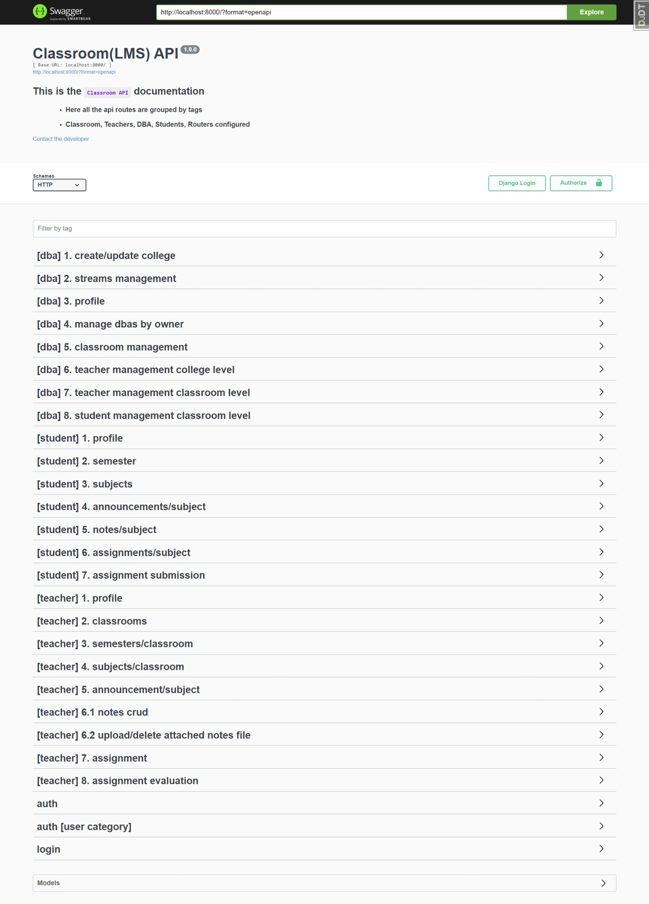
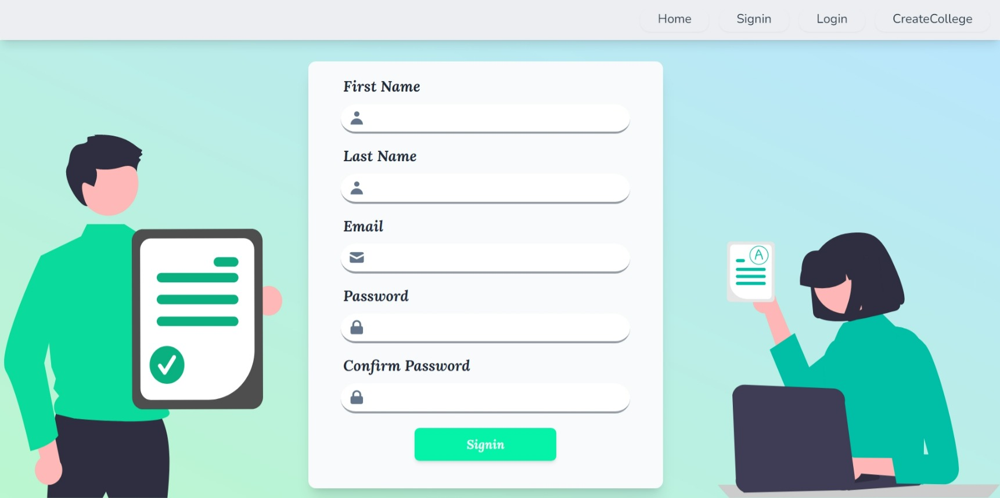
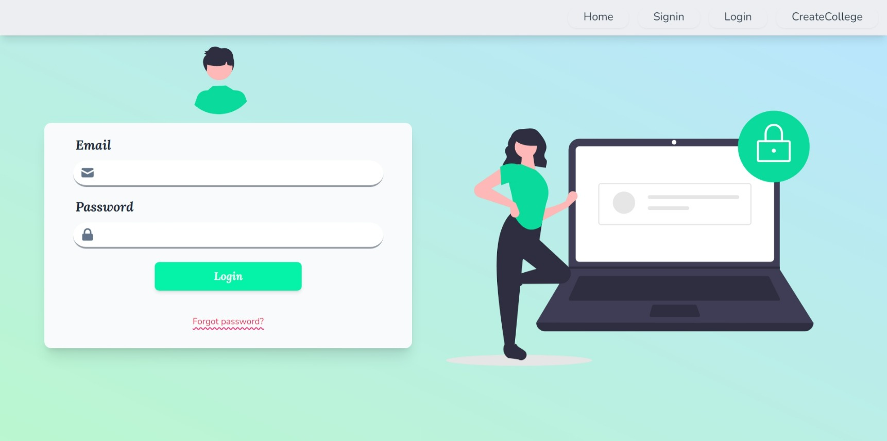
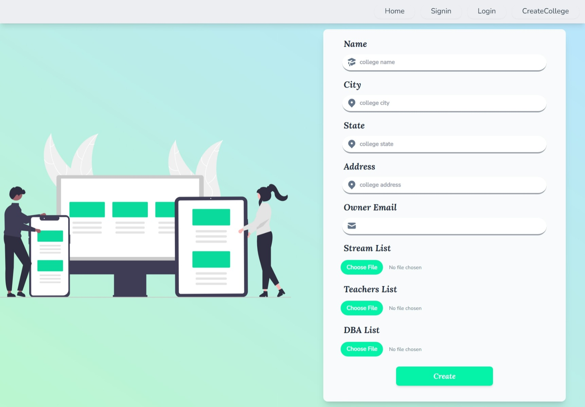
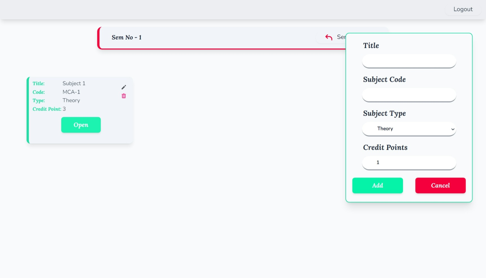

# Classroom LMS API (Backend)

---

> #### 4 th Sem Major `Project`
>
> - In this Project I have developed this whole API
> - This API has 5 Modules :
>   - Authentication
>   - Owner Admin
>   - Admin with less privileges
>   - Teacher
>   - Student

---

> **API Doc**
>
> 

[](readme\whole_sw_review.mp4)
---

### Contributors

---

> - [Pritam Chakraborty (Backend Dev & Frontend Designer)](https://github.com/PritamChk)
> - [Tathagata Das (Frontend Developer)](https://github.com/TathagataDas99/)
> - [Rimi Mondal (Tester)](https://github.com/RimiDeb13)

---

> #### Project Start Date : 5-Feb-2022
>
> ###### Coding Start Date : 26-April-2022

---

## Technology Stack

---

<p float="left">
<a href="https://www.python.org/">

</a>
<a href="https://www.djangoproject.com/start/">

</a>

<a href="https://www.django-rest-framework.org/">

</a>

<a href="https://www.fullstackpython.com/celery.html">

</a>

<a href="https://redis.io/">

</a>

<a href="https://www.docker.com/">

</a>

<a href="https://github.com/rnwood/smtp4dev">

</a>
</p>

> `OS` - `Windows 10`

---

# Recommended Setup

---

> **Install** :

1. [VS Code](https://code.visualstudio.com/)
   2.Install [Docker](https://www.docker.com/get-started/) & Run It
2. Save `docker-entrypoint.sh` & `wait-for-it.sh` with `LF` line feed.
3. use the following command for first time build:

```powershell
docker-compose up --build
```

5. create super user for django admin area
   (one time)

```bash
docker-compose run web python manage.py createsuperuser
```

6. for other commands check out the `Pipfile`

---

## Some Glimpse of Frontend :

---

<p float="left">

</p>

<p float="left">


</p>

<p float="left">


</p>
---

## To Know More About Frontend :
> #### [Click Here [↗]](https://github.com/TathagataDas99/Classroom-Frontend)

---
