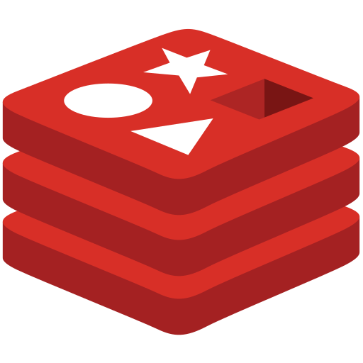

# Classroom LMS API (Backend)

---

> #### 4 th Sem Major `Project`
>
> - In this Project I have developed this whole API
> - This API has 5 Modules :
>   - Authentication
>   - Owner Admin
>   - Admin with less privileges
>   - Teacher
>   - Student

---

> **API Doc**
>
> 

---

### Contributors

---

> - [Pritam Chakraborty (Backend Dev & Frontend Designer)](https://github.com/PritamChk)
> - [Tathagata Das (Frontend Developer)](https://github.com/TathagataDas99/)
> - [Rimi Mondal (Tester)](https://github.com/RimiDeb13)

---

> #### Project Start Date : 5-Feb-2022
>
> ###### Coding Start Date : 26-April-2022

---

## Technology Stack

---

> `OS` - `Windows 10`

---

